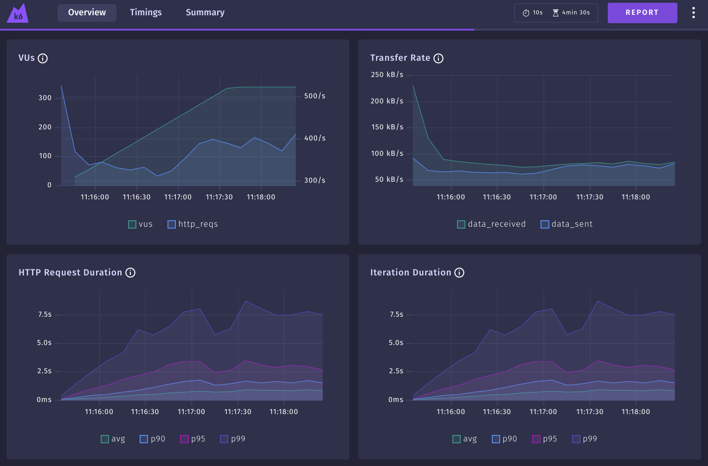

### Port do teste de carga da [rinha-backend-2024-q1](https://github.com/zanfranceschi/rinha-de-backend-2024-q1) escrita com [Gatling](https://gatling.io/) para o [Grafana K6](https://k6.io)

Projeto criado apenas para praticar o uso do K6

Existem muitas diferenças entre o K6 e o Gatling:
 - Atualmente o K6 não permite iniciar um cenário logo após o outro no mesmo teste, é possível configurar o tempo de início, por isso preferi separa as validações em scripts aparte do teste de carga principal
 - No K6 na configuração do cenário para permitir aumento de usuários(ramping-vus) permite apenas configurar o tempo de execução e vai executar um número diferente de interações(requests) da versão em Gatling nos mesmos 4 minutos com o mesmo numero de usuários, dependendo da velocidade do backend
 - No K6 existe o conceito de ciclo de vida, usei ele para fazer as validações de concorrência, executando apenas uma validação após o teste com 25 usuários simultaneous, por isso cada validação fiz em um .js separado

---
### Como rodar o load-test?
Existe um script que executa via docker o k6 com os testes usando a mesma url da rinha http://localhost:9999

```sh
./run-load-test.sh
```
Executa 3 cenários simultaneamente credito/debito/extrato durante 4 minutos iniciando com 1 usuário para cada teste

Durante a execução dos testes além do console, é possível acompanhar em tempo real pelo navegador no [web dashboard](http://127.0.0.1:5665)



---
### Como rodar as validações?
```sh
./run-validacoes.sh
```

---
### JS-Doc e Typescript

Os testes no K6 são escritos na linguagem Javascript sendo executados por um runtime escrito em Go lang

Para melhorar minha experiência escrevendo os testes adicionei as definições em typescript do k6 `@types/k6` combinado com JS-Doc escrevendo os testes em js puro

Para reinstalar local as definições em typescript basta um rodar um `npm install`